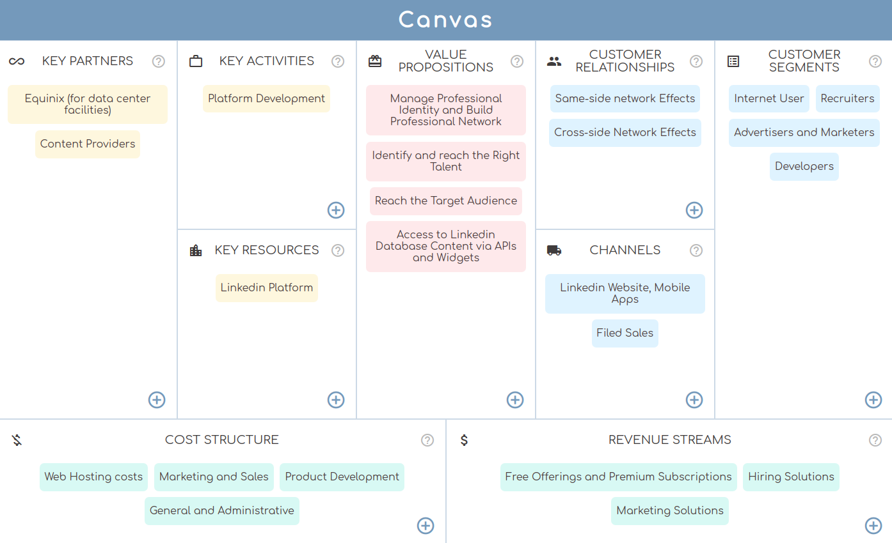

# Canvas



## Introduction

Business Model Canvas is a strategic management and lean startup template for developing new or documenting existing business models.

It is a visual chart with elements describing a firm's or product's value proposition, infrastructure, customers, and finances. It assists firms in aligning their activities by illustrating potential trade-offs.

You can run the deployed project here: https://diana-moreno.github.io/canvas
It's responsive, so you can open it on the device you prefer!

## Technical Description

Frontend: React (javascript), CSS-SASS, BEM, Jest

Backend: Express (Node), Mongoose (MongoDB), Mocha Chai

Others: Git, Github

## Usage

**Prerequisites:**

- Install Node.js if you haven't yet (https://nodejs.org/es/). Npm is needed but is included installing Node.js.

- Install MongoDB (https://docs.mongodb.com/manual/installation/#tutorial-installation).

**Next steps:**

- Download or clone the repository in your local (https://github.com/diana-moreno/canvas.git).

- Install dependencies from the following folders:
  - canvas-api
  - canvas-app
  - canvas-data
  - canvas-utils

running the command in each one:
```
npm i
```

**Running:**

You need to keep opened 3 terminal windows at the same time.

1- From the folder you have installed the data base MongoDB. Enter in the forlder, and inside of 'bin', run the following command. This keeps your data base on.

➜  bin
```
mongod --dbpath ../data
```

2- From 'canvas-api' you must run the backend with Node:

➜  canvas-api
```
node .
```

3- From 'canvas-app' your must open the frontend with React:

➜  canvas-app
```
npm run start
```

Now, the data base is on, the server is running and the frontend connected to backend, you can start playing in the website!

## Instructions for testing

**Testing the backend**

From the folder 'canvas-api', run:

➜  canvas-api
```
npm run test
```
To check test coverage, run:

➜  canvas-api
```
npm run test:coverage
```

**Testing the frontend**

We need to connect the test daba base from the backend, to the frontend test, so is needed to do a litle change in the file '.env' located in the folder 'canvas-api'.

The folders '.env' are privated and included in '.gitignore' in a real proyect, but, in this project, I didn't included them for accesibility purposes.

Switch the '#' to allow connect to test. Remember to restart the server after that:

from:
```
DB_URL = mongodb://localhost:27017/canvas
#DB_URL = mongodb://localhost:27017/canvas-test
```
to:
```
#DB_URL = mongodb://localhost:27017/canvas
DB_URL = mongodb://localhost:27017/canvas-test
```

Run test:

➜  canvas-app
```
npm run test
```

To check test coverage, run:

➜  canvas-app
```
npm run test:coverage
```

**One finished the mode test, remember to swith another time the '#' to allow the data base connects to the real version, not test, and restart the server in each change.**

## Code Coverage

The logic has been tested with a coverage of 79.3% in frontend and 100% in backend.

Frontend coverage


Backend coverage

